# Carbon 中文网

## CH01-概述

功能：注册博主，发博客，评论，点赞，全文检索，文件上传...

技术：前端，后端，数据库，NoSql，文件存储，大数据...

### 功能

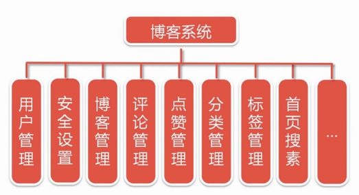

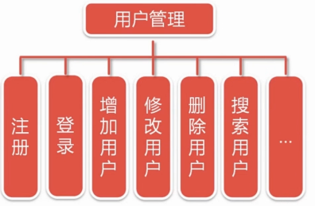

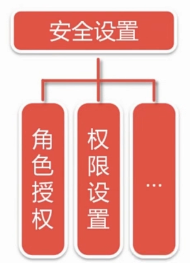

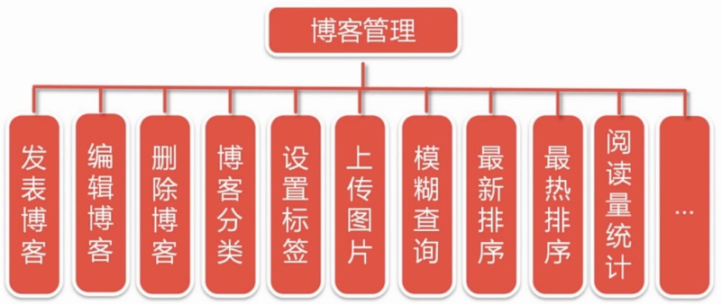

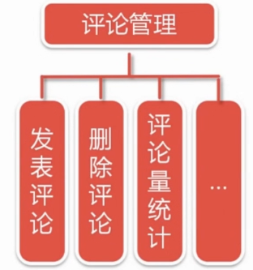

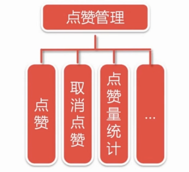

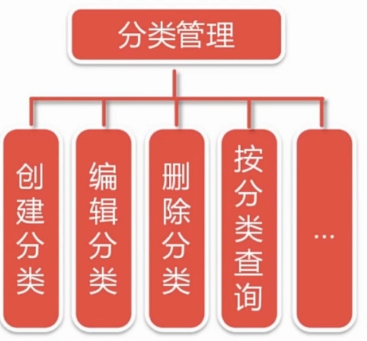


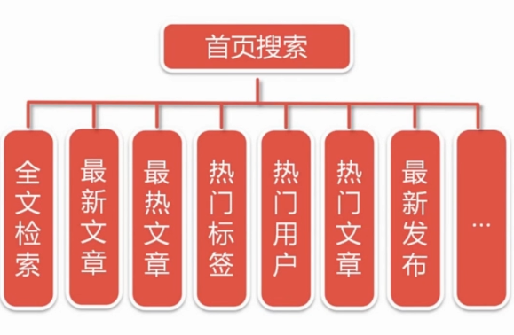

### 技术

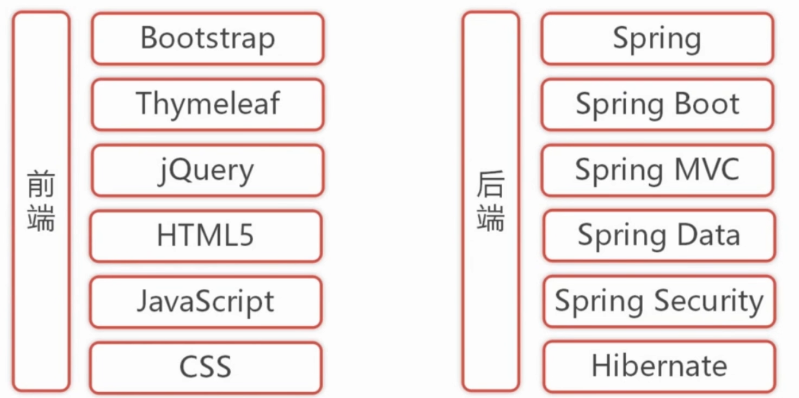

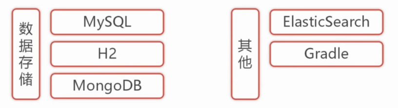

注：

>不采用H2，直接使用 Mysql，前期暂时也不适用 MongoDB，不使用 Hibernate，直接使用 Mybatis，不使用Gradle，直接采用maven，后续图片请更改。

### Spring Boot 是什么？

> * 为所有spring开发提供一个更快，更广泛的入门体验
> * 开箱即用，不适合时候也可以快速抛弃
> * 提供一系列大型项目常用的非功能性特征
> * 零配置（不需要xml配置，遵循“约定大于配置”）

### Spring Boot 简化开发

> 抛弃了传统JavaEE项目繁琐的配置，学习过程，让企业级应用开发变得简单。

### Spring Boot 和其他框架的关系

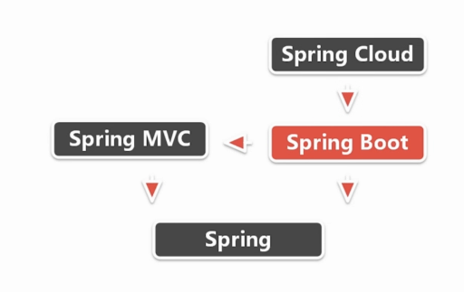

## CH02-开启Spring Boot的第一个项目

### 环境配置

>jdk8
>
>apache-maven-3.6.1
>
>IntelliJ IDEA 2021.2

### 创建项目

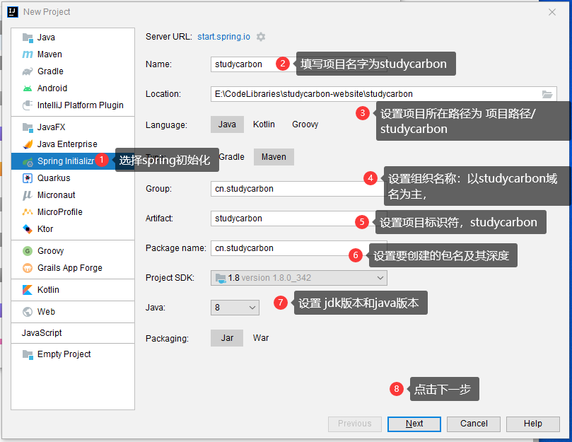

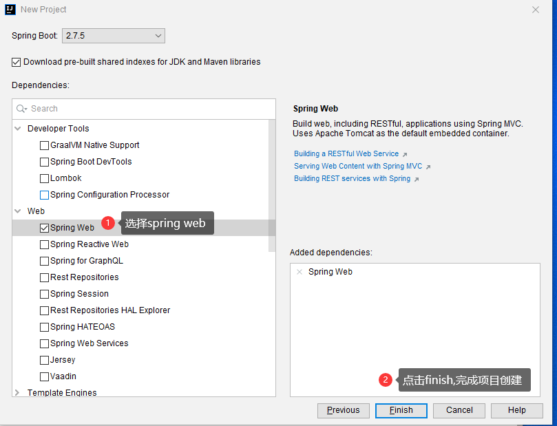

删除如下文件

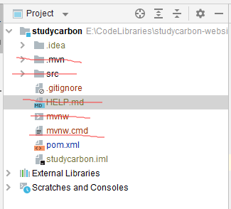

删除文件后，重新加载studycarbon项目

### 运行项目

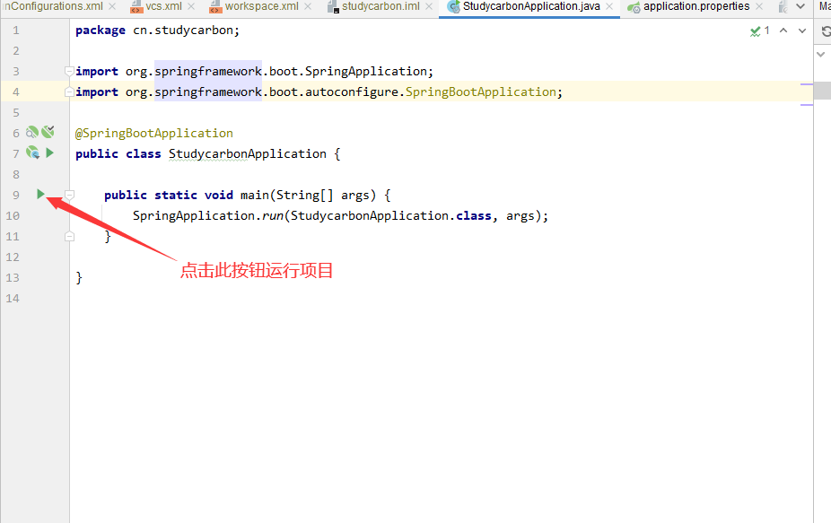

## CH03-编写一个 Hello world 项目

在studycarbon包下面建立一个controller包，里面在建立一个类名为HelloWorldController，HelloWorldController里面内容如下：

```java
package cn.studycarbon.controller;

import org.springframework.web.bind.annotation.RequestMapping;
import org.springframework.web.bind.annotation.RestController;

@RestController
public class HelloWorldController {
    @RequestMapping("/helloWorld")
    public String helloWorld() {
        return "Hello world!";
    }
}

```

运行项目，并在浏览器中输入:[localhost:8080/helloWorld](http://localhost:8080/helloWorld)，可以观察到，浏览器页面中返回了，helloWorld字符串

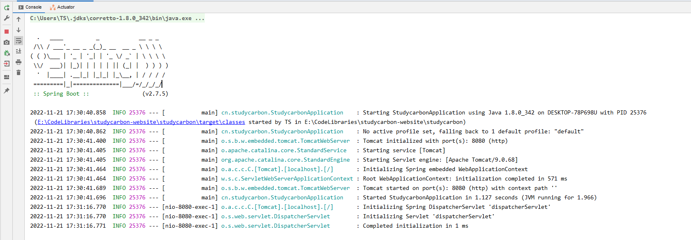

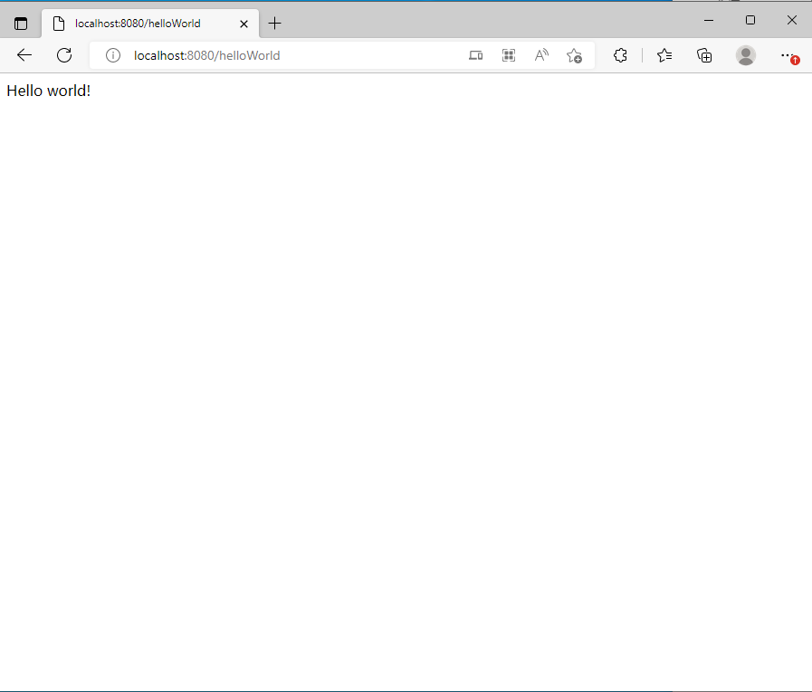

## CH04-开发环境配置

暂无内容~~~

## CH05-集成Thymeleaf

### Thymeleaf： java的模板引擎，

* 能够处理html，xml，javascript，css
* 自然模板。原型即界面
* 语法优雅一动。OGNL，SpringEL
* 遵循Web标准。支持HTML5

### Thymeleaf标准方言

* <span th:text="...">

* <span data-th-text="...">

* 一个简单的thymeleaf的示例

  需要引入th的命名空间才可以使用thymleaf的th标签

```html
<html xmlns:th="http://www.thymeleaf.org">
    <head>
        ....
        <link rel="stylesheet" type="text/css" media="all" href="../../css/gtvg.css" th:href="@{/css/gtvg.css}"/>
    </head>
    <p th:text="#{home.welcome}">
        Welcome to our grocery store!
    </p>
</html>
```

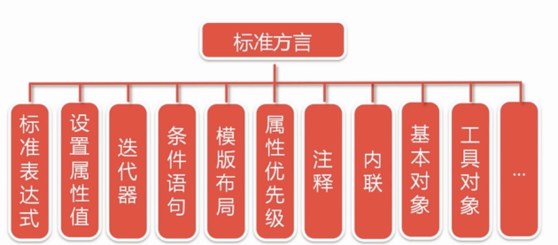

#### 变量表达式

语法：${...}

```html
<span th:text="${book.author.name}"></span>
```

#### 消息表达式

语法：#{...}

也称之为文本外部话，或者国际化

```html
<table>
    ...
    <th th:text="#{header.address.city}">...</th>
    <th th:text="#{header.address.country}">...</th>
    ...
</table>
```

#### 选择表达式

语法：*{...}

```html
<div th:object="${book}">
    ...
    <span th:text="*{title}">...</span>
    ...
</div>
```

#### 链接表达式

语法：@{...}

```html
<!--相对于应用程序上下文-->
<a th:href="@{../documents/report}">...</a>

<!--相对于服务器-->
<a th:href="@{~/documents/report}">...</a>

<!--相对于协议-->
<a th:href="@{//static.mycompany.com/res/initial}">...</a>

<!--link表达式绝对的-->
<a th:href="@{http://www.mycompany.com/main}">...</a>
```

#### 分段表达式

语法: th:insert 或者 th:replace

```html
<!DOCTYPE html>
<html xmls:th="http//www.thymeleaf.org">
    <body>
        <div th:fragment="copy">
            &copy;2017<a href="https://waylau.com">waylau.com</a>
        </div>
    </body>
</html>
```

```html
<body>
    ...
    <div th:insert="~{footer::copy}">
        
    </div>
    ...
</body>
```

#### 字面量

```html
<p>
    now you are looking at 
    <span th:text="working web application">tmplate file</span>
</p>
```

#### 数字

```html
<p>
    the year is <span th:text="2013">1492</span>
</p>
<p>
    in two years, it will be <span th:text="2013+2">1494</span>
</p>
```

#### 布尔

```html
<div th:if="${user.isAdmin()} == false">
    ...
</div>
```

#### null

```html
<div th:if="${variable.something} == null">...
</div>
```

#### 算术操作

+，-，*，/,%

```shell
<div th:with="isEven=$(${prodStat.count} % 2 == 0)"
```

#### 比较和等价

比较>,<,>=,<=(gt,lt,ge,le)

```html
<ul class="pagination" data-th-if="${page.totalPages le 7}">
    
</ul>
```

#### 等价 ==，!= （eq,ne)

```html
<option data-th-each="i : ${#arrays.toIntegerArray(5,10,40,100)}" data-th-value="${i}" data-th-selected="${i eq page.size}" data-th-text="${i}"></option>
```

#### 条件运算符

```html
<tr th:class="${row.even}?'even':'odd'">
...
</tr>
```

#### span 无操作

```html
<span th:text="${user.name?:_}">no user authenticated</span>
```

#### 设置属性值

```html
<form action="subscribe.html" th:attr="action=@{/subscribe}">
    <fieldset>
        <input type="text" name="email"/>
        <input type="submit" value="Subscribe!" th:attr="value=#{subscribe.submit}"/>
    </fieldset>
</
    form>
```

```html
<form action="subscribe.html" th:action="@{/subscribe}">
    
</form>
```

```html
<input type="submit" value="Subscirbe!" th:value="#{subscribe.submit}"/>
```

```html
<input type="checkbox" name="option2" checked> //html
<input type="checkbox" name="option1" checked="checked">//xhtml
<input type="checkbox" name="active" th:checked="${user.active}"> 
```

#### 迭代器

```html
<li th:each="book : ${books}" th:text="${book.title}"> En las Orillas del Sar</li>
```

状态变量：

>index,count,size,current,even/odd,first,last

```html
<table>
    <tr>
        <th>name</th>
        <th>price</th>
        <th>in stock</th>
    </tr>
    <tr th:each="prod,iterStat : ${prods}" th:class="${iterStat.odd}?'odd'">
        <td th:text="${prod.name}">onions</td>
        <td th:text="${prod.price}">2.41</td>
        <td th:text="${prod.inStock}?#{true}:#{false}">yes</td>
    </tr>
</table>
```

#### 条件语句

```html
<a href="comments.html" th:href="@{/product/comments(prodId=$(prod.id))}"></a>
<th:if="${not #list.isEmpty(prod.comments)}">view</th:if>
```

```html
<a href="comments.html" th:href="@{/product/comments(prodId=$(prod.id))}"></a>
<th:unless="${not #list.isEmpty(prod.comments)}">view</th:if>
```

```html
<div th:switch="${user.role}">
    <p th:case="admin">
        user is an admin
    </p>
    <p th:case="#{roles.manager}">
        user is an manager
    </p>
    <p th:case="*">
        user is other
    </p>
</div>
```

#### 模板布局

定义片段

```html
<!DOCTYPE html>
<html xmlns:th="http://www/thymeleaf.org">
    <body>
        <div th:fragment="copy">
            &copy;2017<a href="https://waylau.com">waylau.com</a>
        </div>
    </body>
</html>
```

```html
<div id="copy-section">
    &copy;2017<a href="https://waylau.com">waylau.com</a>
</div>
```


引用片段

```html
<body>
    ...
    <div th:insert="~{footer :: copy}">
        
    </div>
    ...
</body>
```

```html
<body>
    ...
    <div th:insert="~{footer :: #copy-section">
        
    </div>
    ...
</body>
```

th:insert,th:replace,th:include区别：

```html
<body>
    <div th:insert="footer::copy">
    </div>
    <div th:replace="footer::copy">
    </div>
    <div th:include="footer::copy">
    </div> 
</body>
```

#### 属性优先级

当在同一个标签中写入多个th:*属性时，会发生什么？

```html
<ul>
    <li th:each="item : ${items}" th:text="${item.description}"> Item description here....</li>
</ul>
```

| order | feature      | attributes                           |
| ----- | ------------ | ------------------------------------ |
| 1     | 片段引用     | th:insert/th:replace                 |
| 2     | 遍历         | th:each                              |
| 3     | 条件语句     | th:if/th:unless/th:swich/th:case     |
| 4     | 本地变量定义 | th:object/th:with                    |
| 5     | 通常属性设置 | th:attr/th:attrprepend/th:attrappend |
| 6     | 特殊属性设置 | th:value/th:href/th:src ...          |
| 7     | 文本         | th:text/th:utext                     |
| 8     | 片段声明     | th:fragment                          |
| 9     | 片段移除     | th:remove                            |

#### 注释

* thymeleaf解析器级别注释快

删除<!--/*-->和<!--*/-->之间内容

```html
<!--/*-->
...
<!--*/-->
```

* 原型注释块

当模板静态打开时，原型注释快所注释代码将被注释，模板执行时，这些注释代码，将被显示出来。

```html
<!--/**/
...
/*/-->
```

#### 内联

[[...]]或[(...)]分别对应于th:text和th:utext

```html
<p>
    the msg is "[(${msg})]"
</p>

<p>
    the msg is "<b>great!</b>"
</p>

```

```html
<p>
    the msg is "[(${msg})]"
</p>

<p>
    the msg is "&lt;b&gt;great!&lt;/b&gt;"
</p>
```

禁用内联

```html
<p th:inline="none">
    a double array looks like this:[[1,2,3],[4,5]]!</p>
</p>
```

javascript内联

```html
<script>
    ...
    var username=/*[[${session.user.name}]]*/ "Gertrud kiwifruit"
    ...
</script>
```

css内联

```html
classname='main elems'
align='center'
<style>
	.[[${classname}]] {
		text-align:[[${align}]]
	}
</style>
```

#### 表达式基本对象

基本对象

>#ctx:上下文对象。是org.thymeleaf,context.IContext或者org.thymeleaf.context.IWebContext实现
>
>#locale
>
>param
>
>session
>
>application

web上下文对象

>#request
>
>#session
>
>#servletCtx

### thymeleaf和Spring Boot集成

pom.xml添加如下内容

>```xml
><dependency>
>   <groupId>org.springframework.boot</groupId>
>   <artifactId>spring-boot-starter-thymeleaf</artifactId>
></dependency>
>```

application.yml（需要新建这个文件，同时删除application.properties文件)并添加如下内容：

```
spring:
  thymeleaf:
    cache: false 
    prefix: classpath:/templates/
    encoding: UTF-8 #编码
    suffix: .html #模板后缀
    mode: HTML #模板
```

配置说明：

 **cache**这一行是将页面的缓存关闭，不然我们改变页面之后可能不能及时看到更改的内容，默认是true。

 **prefix**是配置thymeleaf模板所在的位置。

 **encoding** 是配置thymeleaf文档的编码，后面的就不说了

注：更详细情况请参考：[SpringBoot系列（六）集成thymeleaf详解版 - 全栈学习笔记 - 博客园 (cnblogs.com)](https://www.cnblogs.com/swzx-1213/p/12726432.html)

#### thymeleaf实战

> ThymeleafUserController
>
> ThymeleafUserDao
>
> ThymeleafUser
>
> template/ThymeleafUser

## CH06 - Spring Data JPA

* jpa简介

* spring data jpa 用法介绍
* spring data jpa,hibernate与springboot集成
* 数据持久化实战

### jpa简介

#### 什么是jpa？

* jpa（java persistence api)用于管理java EE和java SE环境中的持久化，以及对象/映射关系的Java api
* 最新规范为"jsr 338:java persistence 2.1" https://jcp.org/en/jsr/detail?id=338
* 实现:eclipseLink,Hibernate，apache OpenJPA

#### jpa核心概念

* 实体表示关系数据库中的表
* 每个实体示例对应于该表中的行
* 类必须用javax.persistence.Entity注解

* 类必须有一个public或者protected无参数的构造函数

* 实体实例被当作值以分离对象方式进行传递（如通过会话bean的远程业务接口），则该分类必须实现Serializable接口

* 唯一对象标识符：简单主键（javax.persistence.Id),复合主键（javax.persistence.EmbeddedId和javax.persistence.IdClass)

* 关系

  * 一对一 @OneToOne
  * 一对多 @OneToMany
  * 多对一 @ManyToOne
  * 多对多 @ManyToMany

* EntityManager

  * 定义用于与持久性上下文交互的方法
  * 创建和删除持久实体实例，通过实体的主键查找实体
  * 允许在实体上运行查询

  * 获取EntityManager实例

    ```java
    @PersistenceUnit
    EntityManagerFactory emf;
    EntityManager em;
    @Resource
    UserTransaction utx;
    ...
    em = emf.createEntityManager();
    try {
        utx.begin();
        em.persist(someEntity);
        em.merge(AnotherEntity);
        em.remove(ThirdEntity);
        utx.commit()
    } catch(Exception e) {
        utx.rollback();
    }
    ```

  * 查找实体

    ```
    @PersistenceContext
    EntityManage em;
    public void enterOrder(int custID, CustomerOrder newOrder) {
    	Customer cust = em.find(Customer.class, custID);
    	cust.getOrders().add(newOrder);
    	newOrder.setCustomer(cust);
    }
    ```

#### Spring Data jpa简介

* 是更改spring data 家族的一部分

* 对基于jpa的数据访问层增强支持

* 更容易构建基于使用spring数据访问技术栈的应用程序

* Spring data jpa常用接口

  CrudRepository

  ```java
  public interface CrudRepository<T, ID extends Serializable> extends REpository<T,ID> {
      <S extends T> S save(S entity);
      T findOne(ID primaryKey);
      Iterable<T> findAll();
      Long count();
      void delete(T entity);
      boolean exists(ID primaryKey);
      ....
  }
  ```

  PagingAndSortingRepository:实现排序和分页的

  ```java
  public interface PaingAndSortingRepository<T,ID extends Serializable> extends CrudRepository<T,ID> {
      Iterable<T> findAll(Sort sort);
      Page<T> findAll(Pageable pageable);
  }
  ```

* Spring Data Jpa自定义接口

```java
public interface PersonRepositoy extends Repository<User, Long> {
    List<Person> findByEmailAddressAndLastName(EmailAddress emailAddress, String lastname);
    List<Person> findDistinctPeopleByLastNameOrFirstName(String lastname,String firstname);
    ....
}
```

### spring data jpa, hibernate与spring boot集成

#### 配置环境：

>mysql community server 5.7.17
>
>spring data jpa 1.11.1.Release
>
>hibernate 5.2.8.final
>
>mysql connector/j 6.0.5

#### 修改pom.xml

>```
><dependency>
>   <groupId>org.springframework.boot</groupId>
>   <artifactId>spring-boot-starter-data-jpa</artifactId>
></dependency>
>
><dependency>
>   <groupId>mysql</groupId>
>   <artifactId>mysql-connector-java</artifactId>
></dependency>
>```

#### 直接启动报错


参考博客：[开发工具 - springboot整合h2数据库_祈望每天自然醒的博客-CSDN博客_springboot整合h2](https://blog.csdn.net/yeahPeng11/article/details/120257881?ops_request_misc=%7B%22request%5Fid%22%3A%22166911009716800180644098%22%2C%22scm%22%3A%2220140713.130102334..%22%7D&request_id=166911009716800180644098&biz_id=0&utm_medium=distribute.pc_search_result.none-task-blog-2~all~sobaiduend~default-1-120257881-null-null.142^v66^control,201^v3^control_2,213^v2^t3_esquery_v3&utm_term=springboot h2数据库&spm=1018.2226.3001.4187)

#### 添加h2依赖后，启动正常.

```
<dependency>
	<groupId>com.h2database</groupId>
	<artifactId>h2</artifactId>
	<scope>runtime</scope>
	<version>1.4.193</version>
</dependency>
```

#### 启动完成后，在浏览器中输入 [localhost:8080/h2-console](http://localhost:8080/h2-console)


#### 在yml中启用控制台

```
spring:
  h2:
    console:
      enabled: true

```

#### mysql整合jpa

pom.xml配置

```yml
spring:
  datasource:
    url: jdbc:mysql://localhost/blog?userSSL=false&serverTimezone=UTC&characterEncoding=utf-8 #设置jdbc url
    username: root                              #用户名
    password: 123456                            #密码
    driver-class-name: com.mysql.cj.jdbc.Driver # 驱动项配置

  jpa:
    show-sql: true
    hibernate:
      ddl-auto: create-drop

```

mysql创建blog数据库

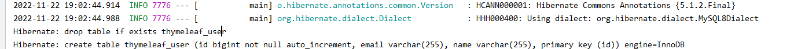

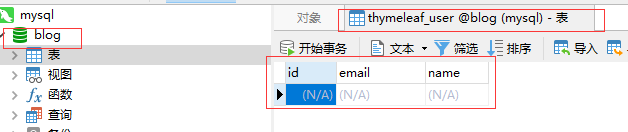

### CH07-ElasticSearch

#### 全文搜索

如：在百度搜索框中搜索

 数据结构

>结构化：指定固定格式或者有限长度数据，如数据库，元数据等
>
>非结构化数据：邮件，word文件

非机构化数据搜索

>顺序扫描法：操作系统中比较常见，如搜索某个文件
>
>全文搜索：将非结构化数据的提取一部分信息转化为结构化数据，最后搜索结构化搜索。将非结构化数据转化为结构化数据就是建立索引的过程。

概念：全文搜索是一种将文件中所有文本与搜索向匹配的文字资料检索方法。

#### 全文搜索原理

建立文本库 -> 建立索引（提取规律：偏旁或者拼音）-> 执行搜索 -> 过滤结果

#### 全文搜索实现技术

基于java的开源实现

>lucene
>
>ElasticSearch
>
>solr


#### ElasticSerch 简介：

高度可扩展的开源全文搜索和分析引擎

快速地，近实时地对大数据进行存储，搜索和分析

用来支撑有复杂的数据搜索需求的企业级应用

#### ElasticSearch特点

分布式，高可用，多类型，多api，面向文档，近实时，基于lucene,基于apache协议

#### ElasticSearch核心概念

近实时：一般延迟在1秒左右

集群：一个或者多个，名称默认为ElasticSearch

节点：集群中的单台服务器，可自定义节点名称

索引：类似于字典中的目录

类型：对产品进行分类

文档：索引的基本单位，具体的产品的信息，对应实体

分片：数据比较大时候，需要进行分片

副本：对原数据进行拷贝，增加吞吐量和搜索量

#### ElasticSearch和spring boot集成

配置环境

>  Elasticsearch 2.4.4
>
> spring data Elasticsearch 2.1.3.RELEASE 
>
> jna 4.3.0 访问原生的一些东西，es需要这个依赖

pom.xml添加如下依赖

>```yml
><dependency>
>   <groupId>org.springframework.boot</groupId>
>   <artifactId>spring-boot-starter-data-elasticsearch</artifactId>
></dependency>
>
><dependency>
>   <groupId>net.java.dev.jna</groupId>
>   <artifactId>jna</artifactId>
>   <version>4.3.0</version>
></dependency>
>```

#### Elasticsearch实战

参考博客：[Spring Boot 集成 Elasticsearch_攻城狮·正的博客-CSDN博客_springboot @query kql](https://blog.csdn.net/ghdqfhw/article/details/113687869)

修改application.yml

>```
>elasticsearch:
>  username: # 用户名
>  password: #密码
>  connection-timeout: 1s  # 连接超时时间
>  socket-timeout: 30s #
>  uris: ${ES_HOST:localhost}:${ES_PORT:9200} # 端口位置
>```

后台编码

文档：EsBlog

资源库：EsBlogRepository

资源库测试用例 EsBlogRepositoryTest

控制器：BlogController

启动es:

>点击elasticsearch.bat脚本即可

> https://blog.csdn.net/w184167377/article/details/122095865
>
> 启动ElasticSearch报错:error updating geoip database
>
> ingest.geoip.downloader.enabled: false

## CH08-架构设计与分层

## CH09-集成Bootstrap

## CH10-博客系统的需求分析与原型设计

## CH11-权限管理Spring Security

提供安全服务

基于角色的角色管理，什么是角色？用户能做什么往往和角色相关联，限定能做什么不能做什么.

RBAC:基于角色的角色管理(role-based-access-control ),隐式访问控制：

```html
if(user.hasRole("project manager")) {
	//显示按钮
} else {
	//不显示按钮
}
```

显示访问控制

```
if(user.isPermitted("projectReport:view:12345")) {
	//显示报表按钮
} else {
	//不显示报表按钮
}
```

解决方案:

spring security

Spring security简介：

>spring security简介