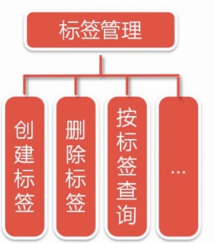

# Carbon 中文网

## CH01-概述

功能：注册博主，发博客，评论，点赞，全文检索，文件上传...

技术：前端，后端，数据库，NoSql，文件存储，大数据...

### 功能





### 技术


注：

>不采用H2，直接使用 Mysql，前期暂时也不适用 MongoDB，不使用 Hibernate，直接使用 Mybatis，不使用Gradle，直接采用maven，后续图片请更改。

### Spring Boot 是什么？

> * 为所有spring开发提供一个更快，更广泛的入门体验
> * 开箱即用，不适合时候也可以快速抛弃
> * 提供一系列大型项目常用的非功能性特征
> * 零配置（不需要xml配置，遵循“约定大于配置”）

### Spring Boot 简化开发

> 抛弃了传统JavaEE项目繁琐的配置，学习过程，让企业级应用开发变得简单。

### Spring Boot 和其他框架的关系


## CH02-开启Spring Boot的第一个项目

### 环境配置

>jdk8
>
>apache-maven-3.6.1
>
>IntelliJ IDEA 2021.2

### 创建项目


删除如下文件


删除文件后，重新加载studycarbon项目

### 运行项目


## CH03-编写一个 Hello world 项目

在studycarbon包下面建立一个controller包，里面在建立一个类名为HelloWorldController，HelloWorldController里面内容如下：

```java
package cn.studycarbon.controller;

import org.springframework.web.bind.annotation.RequestMapping;
import org.springframework.web.bind.annotation.RestController;

@RestController
public class HelloWorldController {
    @RequestMapping("/helloWorld")
    public String helloWorld() {
        return "Hello world!";
    }
}

```

运行项目，并在浏览器中输入:[localhost:8080/helloWorld](http://localhost:8080/helloWorld)，可以观察到，浏览器页面中返回了，helloWorld字符串


## CH04-开发环境配置

暂无内容~~~

## CH05-集成Thymeleaf

### Thymeleaf： java的模板引擎，

* 能够处理html，xml，javascript，css
* 自然模板。原型即界面
* 语法优雅一动。OGNL，SpringEL
* 遵循Web标准。支持HTML5

### Thymeleaf标准方言

* <span th:text="...">

* <span data-th-text="...">

* 一个简单的thymeleaf的示例

  需要引入th的命名空间才可以使用thymleaf的th标签

```html
<html xmlns:th="http://www.thymeleaf.org">
    <head>
        ....
        <link rel="stylesheet" type="text/css" media="all" href="../../css/gtvg.css" th:href="@{/css/gtvg.css}"/>
    </head>
    <p th:text="#{home.welcome}">
        Welcome to our grocery store!
    </p>
</html>
```


#### 变量表达式

语法：${...}

```html
<span th:text="${book.author.name}"></span>
```

#### 消息表达式

语法：#{...}

也称之为文本外部话，或者国际化

```html
<table>
    ...
    <th th:text="#{header.address.city}">...</th>
    <th th:text="#{header.address.country}">...</th>
    ...
</table>
```

#### 选择表达式

语法：*{...}

```html
<div th:object="${book}">
    ...
    <span th:text="*{title}">...</span>
    ...
</div>
```

#### 链接表达式

语法：@{...}

```html
<!--相对于应用程序上下文-->
<a th:href="@{../documents/report}">...</a>

<!--相对于服务器-->
<a th:href="@{~/documents/report}">...</a>

<!--相对于协议-->
<a th:href="@{//static.mycompany.com/res/initial}">...</a>

<!--link表达式绝对的-->
<a th:href="@{http://www.mycompany.com/main}">...</a>
```

#### 分段表达式

语法: th:insert 或者 th:replace

```html
<!DOCTYPE html>
<html xmls:th="http//www.thymeleaf.org">
    <body>
        <div th:fragment="copy">
            &copy;2017<a href="https://waylau.com">waylau.com</a>
        </div>
    </body>
</html>
```

```html
<body>
    ...
    <div th:insert="~{footer::copy}">
        
    </div>
    ...
</body>
```

#### 字面量

```html
<p>
    now you are looking at 
    <span th:text="working web application">tmplate file</span>
</p>
```

#### 数字

```html
<p>
    the year is <span th:text="2013">1492</span>
</p>
<p>
    in two years, it will be <span th:text="2013+2">1494</span>
</p>
```

#### 布尔

```html
<div th:if="${user.isAdmin()} == false">
    ...
</div>
```

#### null

```html
<div th:if="${variable.something} == null">...
</div>
```

#### 算术操作

+，-，*，/,%

```shell
<div th:with="isEven=$(${prodStat.count} % 2 == 0)"
```

#### 比较和等价

比较>,<,>=,<=(gt,lt,ge,le)

```html
<ul class="pagination" data-th-if="${page.totalPages le 7}">
    
</ul>
```

#### 等价 ==，!= （eq,ne)

```html
<option data-th-each="i : ${#arrays.toIntegerArray(5,10,40,100)}" data-th-value="${i}" data-th-selected="${i eq page.size}" data-th-text="${i}"></option>
```

#### 条件运算符

```html
<tr th:class="${row.even}?'even':'odd'">
...
</tr>
```

### span 无操作

```html
<span th:text="${user.name?:_}">no user authenticated</span>
```

#### 设置属性值

```html
<form action="subscribe.html" th:attr="action=@{/subscribe}">
    <fieldset>
        <input type="text" name="email"/>
        <input type="submit" value="Subscribe!" th:attr="value=#{subscribe.submit}"/>
    </fieldset>
</
    form>
```

```html
<form action="subscribe.html" th:action="@{/subscribe}">
    
</form>
```

```html
<input type="submit" value="Subscirbe!" th:value="#{subscribe.submit}"/>
```


