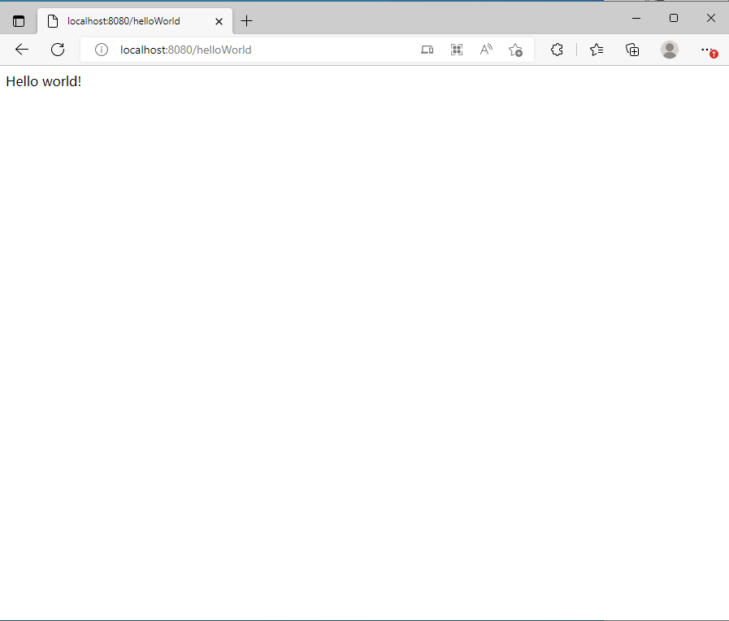

## CH03-编写一个 Hello world 项目

在studycarbon包下面建立一个controller包，里面在建立一个类名为HelloWorldController，HelloWorldController里面内容如下：

```java
package cn.studycarbon.controller;

import org.springframework.web.bind.annotation.RequestMapping;
import org.springframework.web.bind.annotation.RestController;

@RestController
public class HelloWorldController {
    @RequestMapping("/helloWorld")
    public String helloWorld() {
        return "Hello world!";
    }
}

```

运行项目，并在浏览器中输入:[localhost:8080/helloWorld](http://localhost:8080/helloWorld)，可以观察到，浏览器页面中返回了，helloWorld字符串


