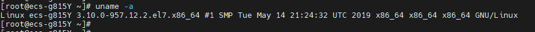
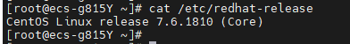
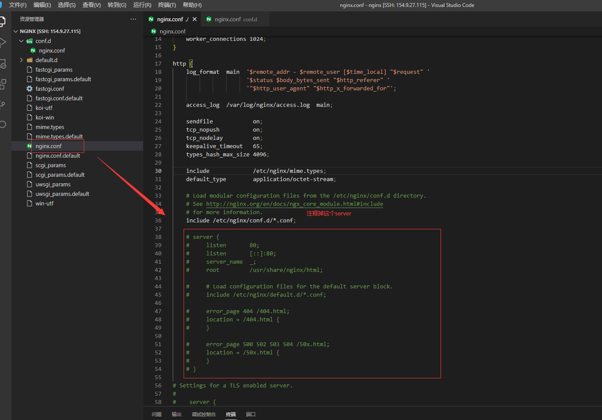
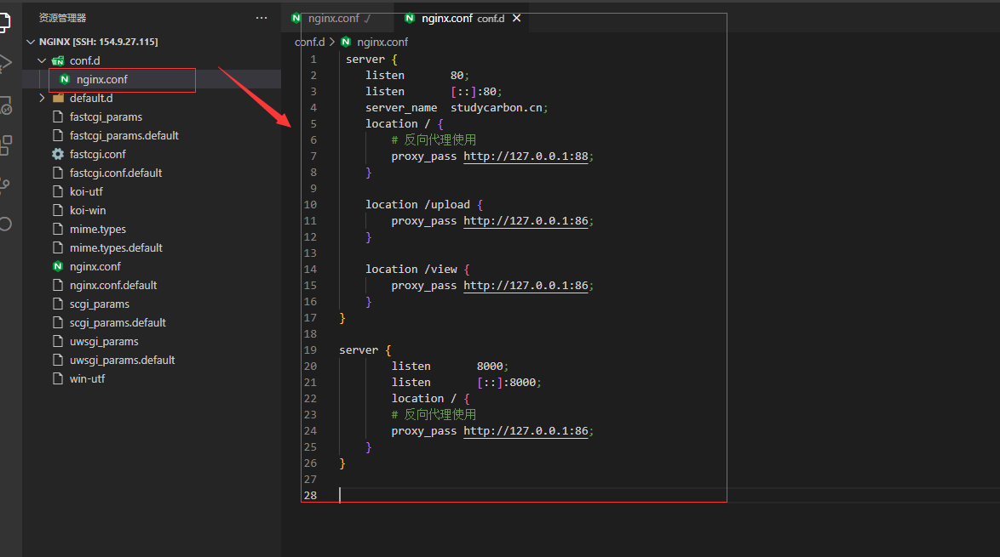
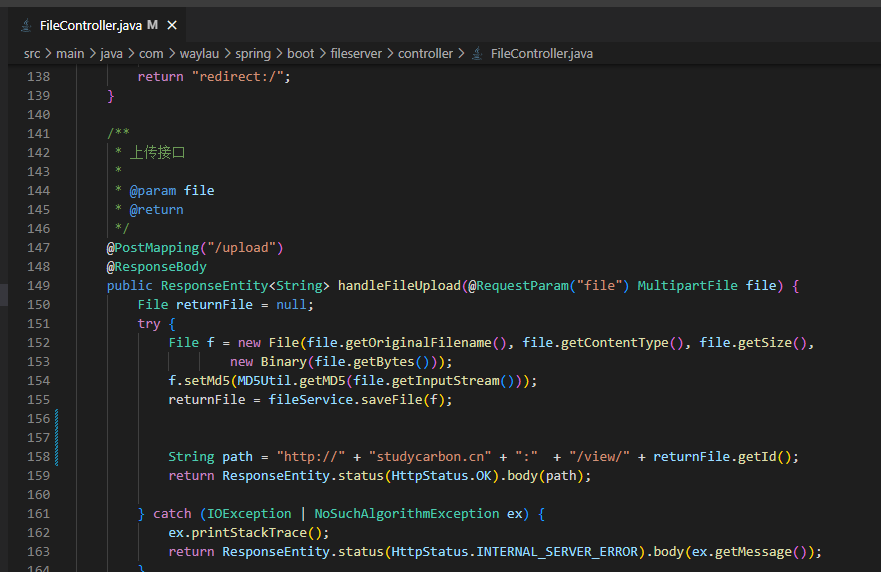
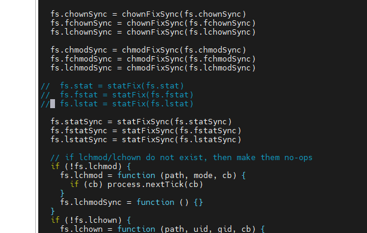

## centos部署

### 登录liunx系统并查看系统信息





### centos下安装nginx

参考资料：[Centos 7下安装配置Nginx-阿里云开发者社区 (aliyun.com)](https://developer.aliyun.com/article/699966)

#### 配置epel源

```
sudo yum install -y epel-release
sudo yum -y update
```

### 安装nginx

```
sudo yum install -y nginx
```

#### 开放80端口及443端口

```
sudo firewall-cmd --permanent --zone=public --add-service=http
sudo firewall-cmd --permanent --zone=public --add-service=https
sudo firewall-cmd --reload
```

#### 操作nginx

##### 启动 Nginx

```
systemctl start nginx
```

##### 停止Nginx

```
systemctl stop nginx
```

##### 重启nginx

```
systemctl restart nginx
```

##### 启用开机启动Nginx

```
systemctl enable nginx
```

##### 禁用开机启动Nginx

```
systemctl disable nginx
```

#### nginx配置

>
>
>

>
>
>

### 部署mongodb-file-server

参考资料：[mongodb-file-server: MongoDB File Server is a file server system based on MongoDB. 基于 MongoDB 的文件服务器。 (gitee.com)](https://gitee.com/waylau/mongodb-file-server)

####  创建工作目录

```
mkdir work-space
cd work-space
```

#### Get source（获取源码）

##### 安装git （安装了可以跳过）

```
sudo yum install -y git
```

##### 下载源代码

```
git clone https://github.com/waylau/mongodb-file-server.git
```

#### 运行

##### 安装java 8

```
yum -y install java-1.8.0-openjdk-devel.x86_64
```

````
java -version
javac
````

##### 安装gradle

参考文档：[centos安装gradle,极简_风行者_斌的博客-CSDN博客](https://blog.csdn.net/u010943460/article/details/50982317)

>```
>cd work-space
># 安装gradle
>wget -c https://downloads.gradle.org/distributions/gradle-4.5-all.zip
>unzip gradle-4.5-all.zip
>mv gradle-4.5 /usr/local/gradle
>
># 创建并加载配置文件
>echo 'export GRADLE_HOME=/usr/local/gradle' > /etc/profile.d/gradle.sh
>echo 'export PATH=$PATH:$GRADLE_HOME/bin'  >> /etc/profile.d/gradle.sh
>. /etc/profile.d/gradle.sh
>```

#### 启动mongodb-file-server

修改源代码：



```
cd mongodb-file-server
gradle bootRun
```

### 部署gitbook服务

参考文档：[GitBook安装部署实操手册 - 知乎 (zhihu.com)](https://zhuanlan.zhihu.com/p/108276695)

[(1条消息) 如何在 CentOS 安装 node.js_centos 安装nodejs_阿基米东的博客-CSDN博客](https://blog.csdn.net/lu_embedded/article/details/79138650?ops_request_misc=%7B%22request%5Fid%22%3A%22168030933716800182753356%22%2C%22scm%22%3A%2220140713.130102334..%22%7D&request_id=168030933716800182753356&biz_id=0&utm_medium=distribute.pc_search_result.none-task-blog-2~all~sobaiduend~default-1-79138650-null-null.142^v80^pc_new_rank,201^v4^add_ask,239^v2^insert_chatgpt&utm_term=centos安装node.js&spm=1018.2226.3001.4187)

#### 安装Node.js

```
sudo yum install nodejs
sudo yum install npm
node --version
npm --version
```

#### 安装gitbook

参考资料：[Gitbook错误"cb.apply is not a function"的解决办法 - 知乎 (zhihu.com)](https://zhuanlan.zhihu.com/p/367562636)

```
npm install gitbook-cli -g
gitbook -V
```

```
vim /usr/local/lib/node_modules/gitbook-cli/node_modules/npm/node_modules/graceful-fs/polyfills.js

```



### 部署studycarbon中文网

#### 安装samba服务器

```
1.拷贝studycarbon.jar到work-space目录
2.启动studycarbon.jar
```

```
# cd mongodb-file-server
# nohup gradle bootRun &

# 启动网站服务
# cd ../
# nohup java -jar studycarbon-0.0.1-SNAPSHOT.jar --server.port=88 &
```

### 防火墙命令操作

```
# 查看已经开放端口
firewall-cmd --list-ports
# 查看防火墙状态
firewall-cmd --state
# 开启防火墙
systemctl start firewalld.service
# 开放8000端口
firewall-cmd --zone=public --add-port=8000/tcp --permanent && firewall-cmd --reload
# 关闭8000端口
firewall-cmd --zone=public --remove-port=8000/tcp --permanent
# 重新加载防火墙
firewall-cmd --reload
```

